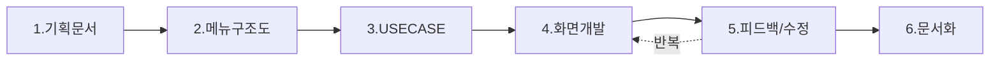

# AI를 활용한 기획 프로세스 가이드
## 기획자를 위한 실무 교육 자료

---

## 📑 목차

| 슬라이드 | 내용 |
|:--------:|------|
| 1 | 교육 개요 및 학습 목표 |
| 2 | 왜 AI를 활용한 기획인가? |
| 3 | 기존 방식 vs AI 활용 방식 |
| 4 | 전체 프로세스 흐름도 |
| 5 | STEP 1: 기획문서(PPT) 작성 |
| 6 | STEP 2: 메뉴구조도 설계 |
| 7 | STEP 3: USECASE 정의 |
| 8 | STEP 4: 화면 프로토타입 개발 |
| 9 | STEP 5: 피드백 & 반복 수정 |
| 10 | STEP 6: 문서화 (명세서/설계서) |
| 11 | AI 프롬프트 작성 핵심 팁 |
| 12 | 실무 적용 Best Practice |
| 13 | 사례 연구: 톡벨 프로젝트 |
| 14 | 자주 묻는 질문 (FAQ) |
| 15 | 마무리 & 다음 단계 |

---

## 슬라이드 1. 교육 개요 및 학습 목표

### 📋 교육 정보
- **교육명**: AI를 활용한 UI/UX 기획 프로세스
- **대상**: 서비스 기획자, PM, PO
- **소요시간**: 약 60분
- **실습 프로젝트**: 톡벨 메시징 서비스

### 🎯 학습 목표

이 교육을 완료하면 다음을 할 수 있습니다:

1. **프로토타입 우선 기획 방식**의 장점을 이해한다
2. AI를 활용하여 **화면 프로토타입을 직접 생성**할 수 있다
3. 효과적인 **AI 프롬프트 작성법**을 익힌다
4. 기획 → 프로토타입 → 문서화의 **전체 워크플로우**를 적용할 수 있다

---

## 슬라이드 2. 왜 AI를 활용한 기획인가?

### 🤔 기존 기획의 Pain Points

| 문제점 | 설명 |
|--------|------|
| ⏰ **시간 소요** | 와이어프레임 → 디자인 → 개발 순차 진행으로 장기간 소요 |
| 📝 **문서 중심** | 텍스트 기반 기획서로 실제 화면 상상이 어려움 |
| 🔄 **소통 비용** | "이거 아닌데요" - 개발 후 수정 요청 빈번 |
| 💭 **추상적** | 이해관계자마다 다르게 해석 |

### ✨ AI 활용의 이점

| 장점 | 효과 |
|------|------|
| 🚀 **즉시 시각화** | 아이디어를 바로 화면으로 확인 |
| 💬 **빠른 피드백** | 실제 화면 기반 구체적 논의 가능 |
| 🔁 **빠른 반복** | 수정사항 즉시 반영, 여러 버전 비교 |
| 📉 **리스크 감소** | 개발 전 화면 확정으로 재작업 최소화 |

> 💡 **핵심 인사이트**: "백 마디 말보다 한 번 보여주는 것이 낫다"

---

## 슬라이드 3. 기존 방식 vs AI 활용 방식

### 📊 프로세스 비교

#### 기존 워터폴 방식
```
기획서 작성 (2주) → 와이어프레임 (1주) → 디자인 (2주) → 개발 (4주) → QA → 수정
                                                                    ↑
                                                            "이거 아닌데요..."
```

#### AI 활용 반복적 방식
```
기획 → USECASE → 화면 프로토타입 → 피드백 → 수정 → 문서화
        ↑___________________________|
              빠른 반복 (1-2일)
```

### ⏱️ 시간 비교 (예시)

| 항목 | 기존 방식 | AI 활용 방식 | 단축률 |
|------|----------|-------------|--------|
| 초기 화면 확인 | 3-4주 | 1-2일 | **90%↓** |
| 수정 반영 | 3-5일 | 수 시간 | **80%↓** |
| 전체 기획 기간 | 6-8주 | 2-3주 | **60%↓** |

---

## 슬라이드 4. 전체 프로세스 흐름도

### 🔄 6단계 프로세스



### 📋 단계별 요약

| 단계 | 작업 | AI 활용 | 산출물 |
|:----:|------|:-------:|--------|
| 1 | 기획문서 작성 | ⭐⭐ | PPT, 기획서 |
| 2 | 메뉴구조도 설계 | ⭐⭐⭐ | 메뉴구조도.md |
| 3 | USECASE 정의 | ⭐⭐⭐ | USECASE.md |
| 4 | 화면 프로토타입 | ⭐⭐⭐⭐⭐ | HTML/CSS/JS |
| 5 | 피드백 & 수정 | ⭐⭐⭐⭐ | 수정된 화면 |
| 6 | 문서화 | ⭐⭐⭐⭐ | 명세서, 설계서 |

> ⭐ = AI 활용도 (많을수록 AI 의존도 높음)

---

## 슬라이드 5. STEP 1: 기획문서(PPT) 작성

### 📝 이 단계에서 할 일

서비스의 **비전, 목표, 핵심 기능**을 정의합니다.

### ✅ 필수 포함 항목

1. **서비스 개요**: 무엇을 만드는가?
2. **타겟 사용자**: 누가 사용하는가?
3. **핵심 기능**: 어떤 가치를 제공하는가?
4. **경쟁사 분석**: 차별점은 무엇인가?
5. **비즈니스 모델**: 어떻게 수익을 내는가?

### 💬 AI 프롬프트 예시

```
[서비스 기획서 초안 작성 요청]

다음 서비스에 대한 기획서 초안을 작성해줘:
- 서비스명: 톡벨
- 서비스 유형: 통합 메시징 플랫폼
- 타겟: 개인/기업 회원
- 핵심 기능: SMS, LMS, MMS, 알림톡, 브랜드톡 발송

포함할 내용: 서비스 개요, 타겟 분석, 핵심 기능 목록, 
예상 메뉴 구조, 수익 모델
```

---

## 슬라이드 6. STEP 2: 메뉴구조도 설계

### 🗂️ 이 단계에서 할 일

서비스의 **전체 메뉴 구조와 화면 계층**을 설계합니다.

### 📐 메뉴구조도 작성 원칙

| 원칙 | 설명 |
|------|------|
| **3클릭 룰** | 모든 기능에 3번 이내 클릭으로 도달 |
| **그룹핑** | 연관 기능끼리 묶어서 구성 |
| **명확한 네이밍** | 사용자가 예측 가능한 메뉴명 |
| **Depth 제한** | 최대 3 Depth까지만 구성 |

### 💬 AI 프롬프트 예시

```
[메뉴구조도 설계 요청]

다음 기능들을 포함한 메시징 서비스의 메뉴구조도를 만들어줘:

핵심 기능:
- 문자 발송 (일반/광고/선거)
- 카카오톡 발송 (알림톡/브랜드톡)
- 주소록 관리
- 발송 결과 조회
- 결제 관리
- 마이페이지

형식: 마크다운 테이블, Depth별 구분
```

### 📋 산출물 예시

| Depth 1 | Depth 2 | Depth 3 | 화면 파일 |
|---------|---------|---------|----------|
| 문자발송 | 일반문자 | - | message-send-general.html |
| 문자발송 | 광고문자 | - | message-send-ad.html |
| 카카오톡 | 알림톡 | 발송 | kakao-send-alimtalk.html |
| 카카오톡 | 알림톡 | 템플릿 | template-alimtalk.html |

---

## 슬라이드 7. STEP 3: USECASE 정의

### 🎭 이 단계에서 할 일

사용자가 **어떤 흐름으로 기능을 사용하는지** 시나리오를 정의합니다.

### 📝 USECASE 구성 요소

```
[USECASE 템플릿]

■ UC-001: 일반문자 발송
├─ Actor: 일반회원, 기업회원  
├─ 사전조건: 로그인 완료, 잔액 보유
├─ 기본흐름:
│   1. 발신번호 선택
│   2. 수신번호 입력 (직접/주소록/엑셀)
│   3. 메시지 내용 작성
│   4. 발송 (즉시/예약)
├─ 대안흐름: 잔액 부족 시 충전 페이지 이동
└─ 사후조건: 발송결과 저장, 잔액 차감
```

### 💬 AI 프롬프트 예시

```
[USECASE 작성 요청]

"일반문자 발송" 기능에 대한 USECASE를 작성해줘.

포함할 내용:
- Actor (사용자 유형)
- 사전조건
- 기본흐름 (단계별)
- 대안흐름 (예외 상황)
- 사후조건

고려사항: 직접입력, 주소록 선택, 엑셀 업로드 방식 모두 포함
```

---

## 슬라이드 8. STEP 4: 화면 프로토타입 개발

### 🎨 이 단계에서 할 일

기획 내용을 바탕으로 **실제 동작하는 HTML 화면**을 생성합니다.

### 🛠️ 기술 스택

| 기술 | 용도 | 이유 |
|------|------|------|
| **HTML** | 화면 구조 | 단순하고 범용적 |
| **CSS** | 스타일링 | 즉시 시각적 확인 |
| **JavaScript** | 인터랙션 | 실제 동작 시뮬레이션 |

> ⚠️ React 등 프레임워크 없이 순수 HTML/CSS/JS만 사용
> → 빠른 생성, 쉬운 수정, 낮은 복잡도

### 💬 AI 프롬프트 예시 (핵심!)

```
[화면 프로토타입 생성 요청]

다음 조건으로 "일반문자 발송" 화면을 만들어줘:

■ 화면 구성:
- 좌측: 발송 설정 영역 (발신번호, 수신번호, 메시지 입력)
- 우측: 미리보기 영역 (휴대폰 목업)

■ 기능 요소:
1. 발신번호: 드롭다운 선택
2. 수신번호: 직접입력 / 주소록 / 엑셀업로드 탭
3. 메시지: 텍스트영역, 바이트 카운터, 이미지 첨부
4. 발송버튼: 즉시발송 / 예약발송

■ 스타일: 
- 깔끔한 비즈니스 스타일
- 메인 컬러: #2563eb (파란색 계열)
- 반응형 불필요 (데스크톱 기준)

■ 기술: HTML, CSS, JavaScript (프레임워크 없이)
```

### ✨ 프롬프트 작성 핵심 포인트

1. **화면 레이아웃**을 구체적으로 설명 (좌/우, 상/하 배치)
2. **기능 요소**를 번호로 나열
3. **스타일 가이드** 명시 (색상, 톤앤매너)
4. **기술 제약** 명확히 (프레임워크 사용 여부)

---

## 슬라이드 9. STEP 5: 피드백 & 반복 수정

### 🔄 이 단계에서 할 일

생성된 화면을 **검토하고 수정 요청**을 반복합니다.

### 📋 피드백 체크리스트

| 검토 항목 | 확인 내용 |
|----------|----------|
| ✅ 레이아웃 | 배치가 의도한 대로인가? |
| ✅ 기능 요소 | 모든 입력 필드가 있는가? |
| ✅ 인터랙션 | 버튼, 탭 등이 동작하는가? |
| ✅ 데이터 흐름 | 입력 → 결과 연결이 자연스러운가? |
| ✅ 예외 처리 | 에러 상태 UI가 있는가? |

### 💬 수정 요청 프롬프트 예시

```
[부분 수정 요청 - 구체적으로!]

현재 화면에서 다음 부분을 수정해줘:

1. 수신번호 입력 영역
   - 현재: 단일 텍스트 입력
   - 변경: 탭 형식 (직접입력 | 주소록 | 엑셀업로드)

2. 바이트 카운터
   - 현재: 없음
   - 추가: 메시지 입력창 하단에 "0/90 bytes (SMS)" 표시
   - 90bytes 초과 시 자동으로 "0/2000 bytes (LMS)" 변경

3. 미리보기 영역
   - 추가: 실시간으로 입력 내용 반영
```

### ⚡ 효과적인 피드백 팁

| DO ✅ | DON'T ❌ |
|-------|---------|
| "A를 B로 변경해줘" | "좀 이상해" |
| "~위치에 ~요소 추가" | "더 예쁘게" |
| 스크린샷 첨부 | 모호한 설명 |
| 한 번에 3개 이내 요청 | 10개 동시 요청 |

---

## 슬라이드 10. STEP 6: 문서화 (명세서/설계서)

### 📚 이 단계에서 할 일

확정된 화면을 기반으로 **개발용 문서**를 작성합니다.

### 📄 산출물 종류

| 문서 | 목적 | 독자 |
|------|------|------|
| **프로젝트 명세서** | 전체 요구사항 정의 | 전체 팀 |
| **상세 개발 설계서** | 페이지별 기술 명세 | 개발자 |
| **모듈별 설계서** | 기능 단위 상세 설계 | 개발자 |
| **기능정의서** | 화면별 기능 상세 | 기획자/QA |

### 💬 AI 프롬프트 예시

```
[기능정의서 생성 요청]

첨부한 HTML 화면(message-send-general.html)을 분석해서
기능정의서를 작성해줘.

포함할 내용:
1. 화면 개요 (목적, URL, 접근 권한)
2. 화면 레이아웃 설명
3. UI 요소별 상세 (입력 필드, 버튼, 테이블 등)
4. 기능 동작 정의 (이벤트 → 동작 → 결과)
5. 유효성 검사 규칙
6. API 연동 명세
7. 에러 처리

형식: 마크다운
```

### 📁 문서 구조 예시

```
docs/
├── 프로젝트_명세서.md          # 전체 요구사항
├── 상세개발설계서.md           # 기술 명세
├── modules/                    # 모듈별 설계서
│   ├── FE-M001-MessageSend.md
│   ├── FE-M002-KakaoSend.md
│   └── ...
└── specs/                      # 기능정의서
    ├── 01_일반문자발송.md
    ├── 02_광고문자발송.md
    └── ...
```

---

## 슬라이드 11. AI 프롬프트 작성 핵심 팁

### 🎯 좋은 프롬프트의 4가지 원칙

#### 1️⃣ 구체적으로 (Specific)
```
❌ "로그인 화면 만들어줘"
✅ "이메일/비밀번호 입력, 로그인 버튼, 회원가입 링크가 있는 
    로그인 화면을 만들어줘. 중앙 정렬, 카드 형태 UI"
```

#### 2️⃣ 구조화해서 (Structured)
```
✅ 좋은 예시:
■ 화면명: 일반문자 발송
■ 레이아웃: 2단 (좌: 입력, 우: 미리보기)
■ 구성요소:
  1. 발신번호 선택
  2. 수신번호 입력
  3. 메시지 작성
■ 스타일: 파란색 계열, 비즈니스 톤
```

#### 3️⃣ 맥락을 제공 (Context)
```
✅ "이 화면은 기업 고객이 대량 문자를 발송하는 B2B 서비스야.
    주 사용자는 마케팅 담당자이고, 하루에 수천 건을 발송해.
    따라서 효율적인 대량 입력이 중요해."
```

#### 4️⃣ 제약 조건 명시 (Constraints)
```
✅ "React 사용하지 말고 순수 HTML/CSS/JS로만 만들어줘"
✅ "외부 라이브러리 없이 구현해줘"
✅ "한국어 UI로 만들어줘"
```

---

## 슬라이드 12. 실무 적용 Best Practice

### ✅ DO - 이렇게 하세요

| 항목 | 설명 |
|------|------|
| **작은 단위로 요청** | 한 화면씩, 한 기능씩 점진적으로 |
| **레퍼런스 제공** | "~사이트의 ~화면처럼" 참고 링크 첨부 |
| **버전 관리** | 생성된 파일을 Git으로 관리 |
| **즉시 확인** | 생성 후 바로 브라우저에서 테스트 |
| **피드백 기록** | 수정 요청 내용을 문서화 |

### ❌ DON'T - 이건 피하세요

| 항목 | 문제점 |
|------|--------|
| **한 번에 모든 화면** | 품질 저하, 일관성 부족 |
| **모호한 요청** | "예쁘게", "좋게" → 결과 예측 불가 |
| **생성 결과 맹신** | 반드시 검토 필요 (비즈니스 로직 오류 가능) |
| **프레임워크 복잡도** | React 등은 수정이 어려움 |

### 💡 실무 팁

> **"완벽한 첫 결과물은 없다"**
> 
> AI 생성물은 70~80% 완성도로 생각하고,  
> 나머지 20~30%는 피드백으로 다듬는다는 마인드셋이 중요합니다.

---

## 슬라이드 13. 사례 연구: 톡벨 프로젝트

### 📱 프로젝트 개요

| 항목 | 내용 |
|------|------|
| **서비스명** | 톡벨 (TalkBell) |
| **서비스 유형** | 통합 메시징 플랫폼 |
| **주요 기능** | SMS/LMS/MMS, 알림톡/브랜드톡 발송 |
| **타겟 사용자** | 개인회원, 기업회원 |

### 📊 산출물 현황

| 구분 | 수량 | 설명 |
|------|:----:|------|
| 사용자 화면 | 40개 | HTML 프로토타입 |
| 어드민 화면 | 20개+ | 관리자 페이지 |
| 모듈 설계서 | 25개 | FE 11 + BE 10 + COM 4 |
| 기능정의서 | 27개 | 사용자 17 + 어드민 10 |

### 🔗 실제 결과물 확인

- **사용자 사이트**: https://spec-pearl-mu.vercel.app/
- **어드민 사이트**: https://admin-weld-ten.vercel.app/

### ⏱️ 소요 기간

| 단계 | 기간 |
|------|------|
| 기획 ~ 메뉴구조도 | 2일 |
| USECASE 정의 | 1일 |
| 화면 프로토타입 (40개) | 5일 |
| 피드백 & 수정 | 3일 |
| 문서화 | 3일 |
| **총 소요 기간** | **약 2주** |

---

## 슬라이드 14. 자주 묻는 질문 (FAQ)

### Q1. 디자이너 없이 진행해도 되나요?

> **A**: 프로토타입 단계에서는 가능합니다. 다만 최종 프로덕션 디자인은 
> 디자이너와 협업하여 다듬는 것을 권장합니다. 프로토타입은 
> "이런 느낌으로 가자"를 합의하는 용도로 활용하세요.

### Q2. 생성된 코드를 그대로 개발에 사용하나요?

> **A**: 아니요. 프로토타입은 **기획 확정용**입니다. 
> 실제 개발은 프로토타입을 참고하여 개발팀이 
> 프로젝트 기술 스택에 맞게 새로 구현합니다.

### Q3. 복잡한 인터랙션도 구현 가능한가요?

> **A**: 기본적인 탭 전환, 모달, 폼 유효성 검사 등은 가능합니다. 
> 복잡한 애니메이션이나 실시간 연동은 "동작한다고 가정"하고 
> UI만 보여주는 수준으로 진행하세요.

### Q4. 어떤 AI 도구를 사용하나요?

> **A**: ChatGPT, Claude, Cursor 등 코드 생성이 가능한 
> AI 도구라면 모두 활용 가능합니다. 
> 이 교육에서는 **Cursor IDE**를 기준으로 설명합니다.

### Q5. 기획자가 코드를 알아야 하나요?

> **A**: HTML 기본 구조 정도만 이해하면 됩니다. 
> 직접 코딩할 필요 없이, AI에게 요청하고 결과를 확인하는 수준이면 충분합니다.

---

## 슬라이드 15. 마무리 & 다음 단계

### 📝 오늘 배운 내용 정리

```
1. 프로토타입 우선 기획의 장점
2. 6단계 프로세스: 기획 → 메뉴 → USECASE → 화면 → 피드백 → 문서
3. 효과적인 AI 프롬프트 작성법
4. 실무 적용 시 주의사항
```

### 🚀 다음 단계 (실습 과제)

| 단계 | 과제 | 예상 시간 |
|:----:|------|:--------:|
| 1 | 담당 서비스의 메뉴구조도 작성 | 2시간 |
| 2 | 핵심 기능 3개의 USECASE 정의 | 2시간 |
| 3 | 메인 화면 1개 프로토타입 생성 | 1시간 |
| 4 | 피드백 반영하여 수정 | 1시간 |

### 📚 참고 자료

- 톡벨 프로젝트 GitHub (사내 공유)
- Cursor IDE 사용 가이드
- 프롬프트 엔지니어링 베스트 프랙티스

### 💬 Q&A

질문이 있으시면 말씀해 주세요!

---

## 📎 부록: 톡벨 프로젝트 상세 정보

### A. 사용자 사이트 화면 목록 (40개)

#### 메인/인증 (4개)
| 파일명 | 화면명 |
|--------|--------|
| `index.html` | 랜딩 페이지 |
| `main.html` | 메인 대시보드 |
| `login.html` | 로그인 |
| `signup.html` | 회원가입 |

#### 문자발송 (4개)
| 파일명 | 화면명 |
|--------|--------|
| `message-send-general.html` | 일반문자 발송 |
| `message-send-ad.html` | 광고문자 발송 |
| `template-message.html` | 일반문자 템플릿 |
| `template-message-ad.html` | 광고문자 템플릿 |

#### 카카오톡 발송 (12개)
| 파일명 | 화면명 |
|--------|--------|
| `kakao-send-alimtalk.html` | 알림톡 발송 |
| `kakao-send-brandtalk.html` | 브랜드톡 발송 |
| `kakao-profile-manage.html` | 발신 프로필 관리 |
| `template-alimtalk.html` | 알림톡 템플릿 |
| `template-brandtalk.html` | 브랜드톡 템플릿 |
| 외 7개 | (등록/수정/미등록 상태 화면) |

#### 기타 (20개)
- 선거문자 4개
- 발송관리 2개
- 주소록 2개
- 결제관리 3개
- 마이페이지 3개
- 고객센터 6개

### B. 모듈 설계서 목록 (25개)

#### Frontend 모듈 (11개)
| ID | 모듈명 | 설명 |
|----|--------|------|
| FE-M001 | MessageSendModule | 문자 발송 |
| FE-M002 | KakaoSendModule | 카카오톡 발송 |
| FE-M003 | TemplateManageModule | 템플릿 관리 |
| FE-M004 | AddressBookModule | 주소록 관리 |
| FE-M005 | SendResultModule | 발송 결과 |
| FE-M006 | PaymentModule | 결제 관리 |
| FE-M007 | MyPageModule | 마이페이지 |
| FE-M008 | AuthModule | 인증/인가 |
| FE-M009 | CommonUIModule | 공통 UI |
| FE-M010 | MainModule | 메인/대시보드 |
| FE-M011 | SupportModule | 고객센터 |

#### Backend 모듈 (10개)
| ID | 모듈명 |
|----|--------|
| BE-M001 ~ BE-M010 | 각 FE 모듈 대응 서비스 |

#### 공통 모듈 (4개)
| ID | 모듈명 |
|----|--------|
| COM-M001 | APIClientModule |
| COM-M002 | DataModelsModule |
| COM-M003 | UtilsModule |
| COM-M004 | ValidationModule |

---

**문서 버전**: 3.0 (교육용)  
**최종 수정일**: 2025년 1월 6일  
**작성**: AI 기획 TF팀


