# 모듈 목록 및 의존성 관계

## 모듈 개요

메시징 서비스 플랫폼을 마이크로모듈 기반으로 설계하여 병렬 개발이 가능하도록 구성했습니다.

## 모듈 목록

### Frontend 모듈

| 모듈 ID | 모듈명 | 담당 기능 | 우선순위 | 예상 기간 |
|---------|--------|----------|----------|-----------|
| FE-M001 | MessageSendModule | 문자 발송 (일반/광고/공직선거) | P0 | 15일 |
| FE-M002 | KakaoSendModule | 카카오톡 발송 (알림톡/브랜드톡) | P0 | 15일 |
| FE-M003 | TemplateManageModule | 템플릿 관리 (문자/알림톡/브랜드톡) | P1 | 12일 |
| FE-M004 | AddressBookModule | 주소록 관리 | P0 | 10일 |
| FE-M005 | SendResultModule | 발송 결과 조회 | P0 | 8일 |
| FE-M006 | PaymentModule | 결제 관리 (충전/내역/세금계산서) | P0 | 12일 |
| FE-M007 | MyPageModule | 마이페이지 (내 정보/발신번호) | P0 | 10일 |
| FE-M008 | AuthModule | 인증/인가 | P0 | 8일 |
| FE-M009 | CommonUIModule | 공통 UI 컴포넌트 | P0 | 10일 |
| FE-M010 | MainModule | 메인/대시보드 | P0 | 8일 |
| FE-M011 | SupportModule | 고객센터 | P1 | 6일 |

### Backend 모듈

| 모듈 ID | 모듈명 | 담당 기능 | 우선순위 | 예상 기간 |
|---------|--------|----------|----------|-----------|
| BE-M001 | MessageServiceModule | 문자 발송 서비스 | P0 | 20일 |
| BE-M002 | KakaoServiceModule | 카카오톡 발송 서비스 | P0 | 20일 |
| BE-M003 | TemplateServiceModule | 템플릿 관리 서비스 | P1 | 15일 |
| BE-M004 | AddressBookServiceModule | 주소록 관리 서비스 | P0 | 12일 |
| BE-M005 | SendResultServiceModule | 발송 결과 서비스 | P0 | 10일 |
| BE-M006 | PaymentServiceModule | 결제 서비스 | P0 | 15일 |
| BE-M007 | UserServiceModule | 사용자 관리 서비스 | P0 | 12일 |
| BE-M008 | AuthServiceModule | 인증/인가 서비스 | P0 | 10일 |
| BE-M009 | NotificationServiceModule | 알림 서비스 | P1 | 8일 |
| BE-M010 | FileServiceModule | 파일 업로드 서비스 | P0 | 8일 |

### 공통 모듈

| 모듈 ID | 모듈명 | 담당 기능 | 우선순위 | 예상 기간 |
|---------|--------|----------|----------|-----------|
| COM-M001 | APIClientModule | API 클라이언트 | P0 | 5일 |
| COM-M002 | DataModelsModule | 데이터 모델 | P0 | 5일 |
| COM-M003 | UtilsModule | 유틸리티 함수 | P0 | 5일 |
| COM-M004 | ValidationModule | 입력 검증 | P0 | 5일 |

## 모듈 의존성 그래프

```mermaid
graph TD
    %% Frontend 모듈
    FE-M001[MessageSendModule] --> FE-M008[AuthModule]
    FE-M001 --> FE-M009[CommonUIModule]
    FE-M001 --> COM-M001[APIClientModule]
    FE-M001 --> COM-M002[DataModelsModule]
    
    FE-M002[KakaoSendModule] --> FE-M008
    FE-M002 --> FE-M009
    FE-M002 --> COM-M001
    FE-M002 --> COM-M002
    
    FE-M003[TemplateManageModule] --> FE-M008
    FE-M003 --> FE-M009
    FE-M003 --> COM-M001
    FE-M003 --> COM-M002
    
    FE-M004[AddressBookModule] --> FE-M008
    FE-M004 --> FE-M009
    FE-M004 --> COM-M001
    FE-M004 --> COM-M002
    
    FE-M005[SendResultModule] --> FE-M008
    FE-M005 --> FE-M009
    FE-M005 --> COM-M001
    FE-M005 --> COM-M002
    
    FE-M006[PaymentModule] --> FE-M008
    FE-M006 --> FE-M009
    FE-M006 --> COM-M001
    FE-M006 --> COM-M002
    
    FE-M007[MyPageModule] --> FE-M008
    FE-M007 --> FE-M009
    FE-M007 --> COM-M001
    FE-M007 --> COM-M002
    
    FE-M009 --> COM-M003[UtilsModule]
    FE-M009 --> COM-M004[ValidationModule]
    
    %% Backend 모듈
    BE-M001[MessageServiceModule] --> BE-M008[AuthServiceModule]
    BE-M001 --> BE-M004[AddressBookServiceModule]
    BE-M001 --> BE-M005[SendResultServiceModule]
    BE-M001 --> BE-M006[PaymentServiceModule]
    BE-M001 --> BE-M010[FileServiceModule]
    
    BE-M002[KakaoServiceModule] --> BE-M008
    BE-M002 --> BE-M004
    BE-M002 --> BE-M005
    BE-M002 --> BE-M006
    BE-M002 --> BE-M010
    
    BE-M003[TemplateServiceModule] --> BE-M008
    BE-M003 --> BE-M010
    
    BE-M004 --> BE-M008
    BE-M004 --> BE-M007[UserServiceModule]
    
    BE-M005 --> BE-M008
    BE-M005 --> BE-M007
    
    BE-M006 --> BE-M008
    BE-M006 --> BE-M007
    BE-M006 --> BE-M009[NotificationServiceModule]
    
    BE-M007 --> BE-M008
    BE-M007 --> BE-M010
    
    %% API 연결
    FE-M001 --> BE-M001
    FE-M002 --> BE-M002
    FE-M003 --> BE-M003
    FE-M004 --> BE-M004
    FE-M005 --> BE-M005
    FE-M006 --> BE-M006
    FE-M007 --> BE-M007
    FE-M008 --> BE-M008
```

## 모듈별 상세 설계서

각 모듈의 상세 설계서는 아래 링크에서 확인할 수 있습니다:

### Frontend 모듈
- [FE-M001: MessageSendModule](./FE-M001-MessageSendModule.md)
- [FE-M002: KakaoSendModule](./FE-M002-KakaoSendModule.md)
- [FE-M003: TemplateManageModule](./FE-M003-TemplateManageModule.md)
- [FE-M004: AddressBookModule](./FE-M004-AddressBookModule.md)
- [FE-M005: SendResultModule](./FE-M005-SendResultModule.md)
- [FE-M006: PaymentModule](./FE-M006-PaymentModule.md)
- [FE-M007: MyPageModule](./FE-M007-MyPageModule.md)
- [FE-M008: AuthModule](./FE-M008-AuthModule.md)
- [FE-M009: CommonUIModule](./FE-M009-CommonUIModule.md)
- [FE-M010: MainModule](./FE-M010-MainModule.md)
- [FE-M011: SupportModule](./FE-M011-SupportModule.md)

### Backend 모듈
- [BE-M001: MessageServiceModule](./BE-M001-MessageServiceModule.md)
- [BE-M002: KakaoServiceModule](./BE-M002-KakaoServiceModule.md)
- [BE-M003: TemplateServiceModule](./BE-M003-TemplateServiceModule.md)
- [BE-M004: AddressBookServiceModule](./BE-M004-AddressBookServiceModule.md)
- [BE-M005: SendResultServiceModule](./BE-M005-SendResultServiceModule.md)
- [BE-M006: PaymentServiceModule](./BE-M006-PaymentServiceModule.md)
- [BE-M007: UserServiceModule](./BE-M007-UserServiceModule.md)
- [BE-M008: AuthServiceModule](./BE-M008-AuthServiceModule.md)
- [BE-M009: NotificationServiceModule](./BE-M009-NotificationServiceModule.md)
- [BE-M010: FileServiceModule](./BE-M010-FileServiceModule.md)

### 공통 모듈
- [COM-M001: APIClientModule](./COM-M001-APIClientModule.md)
- [COM-M002: DataModelsModule](./COM-M002-DataModelsModule.md)
- [COM-M003: UtilsModule](./COM-M003-UtilsModule.md)
- [COM-M004: ValidationModule](./COM-M004-ValidationModule.md)

## 개발 순서 권장사항

### Phase 1: 기반 구축 (1주)
1. COM-M001: APIClientModule
2. COM-M002: DataModelsModule
3. COM-M003: UtilsModule
4. COM-M004: ValidationModule
5. FE-M009: CommonUIModule
6. BE-M008: AuthServiceModule
7. FE-M008: AuthModule

### Phase 2: 핵심 기능 (3주)
1. BE-M007: UserServiceModule
2. BE-M010: FileServiceModule
3. FE-M007: MyPageModule
4. BE-M004: AddressBookServiceModule
5. FE-M004: AddressBookModule
6. BE-M001: MessageServiceModule
7. FE-M001: MessageSendModule

### Phase 3: 확장 기능 (2주)
1. BE-M002: KakaoServiceModule
2. FE-M002: KakaoSendModule
3. BE-M003: TemplateServiceModule
4. FE-M003: TemplateManageModule

### Phase 4: 관리 기능 (2주)
1. BE-M005: SendResultServiceModule
2. FE-M005: SendResultModule
3. BE-M006: PaymentServiceModule
4. FE-M006: PaymentModule
5. BE-M009: NotificationServiceModule

## 모듈 간 통신 규칙

1. **Frontend ↔ Backend**: REST API를 통한 통신
2. **모듈 간 이벤트**: Event Bus를 통한 비동기 통신
3. **공통 데이터**: 공통 모듈을 통한 공유
4. **인증/인가**: AuthModule/AuthServiceModule을 통한 중앙 관리

## 버전 관리

각 모듈은 독립적인 버전 관리를 하며, 메인 프로젝트 버전과 별도로 관리됩니다.

**문서 버전**: 1.0  
**작성일**: 2024-11-19

